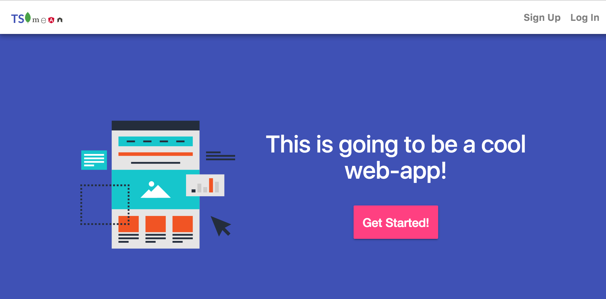

# Foreword
The interest in the MEAN Stack (Mongo-Express-Angular-Node) seems to have peaked in May 2016
according to Google Trends.
While I can imagine a multitude of reasons for this
(from Anguar
now being Angular4 , to mean
/ meanjs.org being
quite out of date or the rise of other frameworks / libs like ReactJS or MeteorJS)
, it's still a viable full-stack-js solution.
For me, however, with one big change:
MEAN-JS becomes **MEAN-TS** (TS = Typescript).

The use of typescript is literally exploding at the moment. Angular is now
completely written in typescript. So is RxJS. The list of projects
migrating is long, which is a good thing for friends of typed languages.
However, for the backend-part (Mongo-Express-Node) of the MEAN stack, I haven't
found a good typescript boilerplate yet. By good I mean 100% typescript,
including the unit tests. So I set out to create this boilerplate.
And this is what's resulted from it.


# Installation

First, get the code using

```
git clone https://github.com/bersling/typescript-mongo-express-angular-node-seed.git project-name
cd project-name
git submodule init
git submodule update
```

Then, since backend and frontend are well separated through a REST-API,
they are also installed separately.

## Backend
Check out the backend instructrions:
https://github.com/bersling/typescript-mongo-express-node-seed

## Frontend
Check out the frontend instructions:
https://github.com/bersling/typescript-angular-seed

## Live Demo
http://demo.tsmean.com

## How everything can be set up from scratch
I've documented the steps of the journey here:
[www.tsmean.com](http://www.tsmean.com). This documenation might
at some points be somewhat behind the actual repository.
